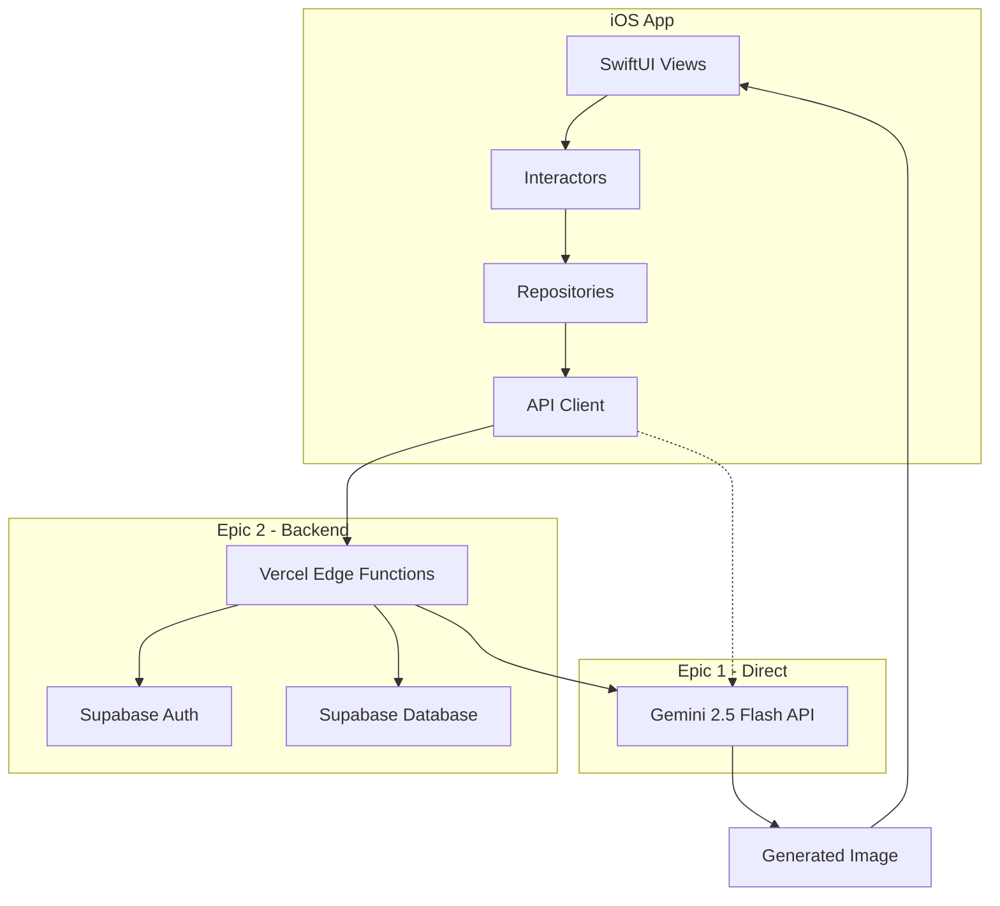

# Facemake v3 Fullstack Architecture Document

## Document Control
- **Version:** 1.0
- **Date:** 2025-09-14
- **Author:** Winston (Architect)
- **Status:** Implementation Ready

## 1. Introduction

This document outlines the complete fullstack architecture for Facemake v3, including backend systems, frontend implementation, and their integration. It serves as the single source of truth for AI-driven development, ensuring consistency across the entire technology stack.

Following **Clean Architecture** principles from iOS best practices and **serverless patterns** from Vercel/Supabase integration, we achieve clear separation of concerns while maintaining the radical simplicity required by the PRD.

### Starter Template
N/A - Greenfield project. Building with:
- **iOS Frontend:** Native SwiftUI following Clean Architecture patterns
- **Backend:** Vercel Edge Functions + Supabase (Auth, Database)
- **AI Service:** Google Gemini 2.5 Flash (image generation preview)

## 2. High Level Architecture

### Technical Summary
Facemake v3 implements a native iOS frontend with SwiftUI following Clean Architecture patterns, backed by Vercel Edge Functions and Supabase for authentication and data persistence. The core image generation uses Google Gemini 2.5 Flash API for generating professional headshots from prompts. The two-epic approach allows Epic 1 to function completely client-side with direct API calls, while Epic 2 adds proper backend infrastructure.

### Platform and Infrastructure
- **Platform:** Vercel (Edge Functions) + Supabase (Auth/Database)
- **Key Services:** Vercel Edge Functions, Supabase Auth/Database, Gemini 2.5 Flash
- **Deployment Regions:** Vercel Global Edge, Supabase US East

### Repository Structure
- **Structure:** Single repository, iOS-focused
- **Package Organization:** iOS app (Swift), Vercel functions (TypeScript), Shared types

### Architecture Diagram


### Architectural Patterns
- **Clean Architecture (iOS):** Separation of Views, Interactors, and Repositories
- **Serverless Functions:** Stateless API handlers on Vercel Edge
- **Repository Pattern:** Abstract data access from Gemini API
- **JWT Authentication:** Supabase-managed tokens
- **Atomic State Management:** SwiftUI @State and @StateObject

## 3. Tech Stack

| Category | Technology | Version | Purpose | Rationale |
|----------|------------|---------|---------|-----------|
| Frontend Language | Swift | 5.9+ | iOS development | Native performance |
| Frontend Framework | SwiftUI | iOS 17+ | Declarative UI | Modern iOS standard |
| State Management | SwiftUI @State | Built-in | Local state | Native patterns |
| Backend Language | TypeScript | 5.0+ | Edge Functions | Type safety |
| Backend Framework | Vercel Edge Runtime | Latest | Serverless | Auto-scaling |
| API Style | REST | HTTP/1.1 | Simple JSON API | Simplicity for MVP |
| Database | PostgreSQL (Supabase) | 15+ | User data | Managed service |
| Authentication | Supabase Auth | 2.0+ | JWT auth | iOS SDK support |
| AI Service | Google Gemini 2.5 Flash | Latest | Image generation | Native multimodal |
| Build Tool | Xcode | 15+ | iOS builds | Required for iOS |
| CI/CD | GitHub Actions | Latest | Automation | Free tier |
| Monitoring | Vercel Analytics | Built-in | Metrics | Included |

## 4. Data Models

### User Model
```typescript
interface User {
  id: string;                    // UUID from Supabase Auth
  email: string;
  fullName?: string;
  createdAt: Date;
  subscriptionStatus: 'free' | 'pro';
  subscriptionExpiresAt?: Date;
  appleUserId?: string;
  consentAcceptedAt: Date;
}
```

### CreditsBalance Model
```typescript
interface CreditsBalance {
  userId: string;                 // FK to User
  creditsRemaining: number;       // 0-3 for free tier
  lastResetAt: Date;
  updatedAt: Date;
}
```

### GenerationRecord Model
```typescript
interface GenerationRecord {
  id: string;
  userId: string;
  promptStyle: number;           // 1-6
  angleValue: number;            // -1 to 1
  backgroundType: 'professional' | 'casual';
  status: 'pending' | 'success' | 'failed';
  errorCode?: string;
  createdAt: Date;
  processingTimeMs?: number;
}
```

## 5. API Specification

### REST API (OpenAPI 3.0)
```yaml
openapi: 3.0.3
info:
  title: Facemake API
  version: 1.0.0

components:
  securitySchemes:
    bearerAuth:
      type: http
      scheme: bearer
      bearerFormat: JWT

paths:
  /generate:
    post:
      summary: Generate professional headshot
      requestBody:
        required: true
        content:
          application/json:
            schema:
              type: object
              properties:
                image:
                  type: string
                  format: base64
                angleValue:
                  type: number
                  minimum: -1
                  maximum: 1
                backgroundType:
                  type: string
                  enum: [professional, casual]
      responses:
        '200':
          description: Success
          content:
            application/json:
              schema:
                type: object
                properties:
                  success:
                    type: boolean
                  imageUrl:
                    type: string
                  creditsRemaining:
                    type: integer
```

### Rate Limiting & Timeouts
- 5 requests/minute per user (authenticated)
- 20 requests/hour per IP (unauthenticated)
- 1 concurrent request per user
- **Gemini API timeout:** 30 seconds
- **API route timeout:** 60 seconds
- **Client timeout:** 65 seconds (buffer for network)

## 6. Component Architecture

### iOS App Components (Clean Architecture)

#### Presentation Layer - Views
- TitleView, CaptureView, StyleSelectionView, ResultView
- SwiftUI, Combine for reactive updates

#### Business Logic Layer - Interactors
- AuthInteractor, GenerationInteractor, CreditsInteractor
- Swift async/await, Combine publishers

#### Data Access Layer - Repositories
- GeminiRepository, AuthRepository, UserRepository
- URLSession, Supabase Swift SDK

#### Shared State - AppState
```swift
class AppState: ObservableObject {
    @Published var isAuthenticated: Bool
    @Published var user: User?
    @Published var creditsRemaining: Int
    @Published var generationInProgress: Bool
    @Published var lastGeneratedImage: UIImage?
}
```

### Backend Components

#### API Gateway Function
- Route and authenticate requests
- TypeScript, Vercel Edge Runtime

#### Generation Service
- Construct prompts and call Gemini 2.5 Flash
- Google AI SDK

#### Credits Manager
- Single atomic Supabase RPC function
- No locking needed - simple SQL decrement
```sql
-- Supabase RPC: decrement_credits
CREATE OR REPLACE FUNCTION decrement_credits(user_id UUID)
RETURNS INTEGER AS $$
  UPDATE credits_balance
  SET credits_remaining = credits_remaining - 1
  WHERE user_id = $1 AND credits_remaining > 0
  RETURNING credits_remaining;
$$ LANGUAGE sql SECURITY DEFINER;
```

## 7. Deployment Architecture

### Deployment Strategy
- **Frontend:** Apple App Store via TestFlight
- **Backend:** Vercel Edge Functions (Git-based deployment)

### CI/CD Pipeline
```yaml
name: Deploy
on:
  push:
    branches: [main]

jobs:
  deploy-backend:
    runs-on: ubuntu-latest
    steps:
      - uses: actions/checkout@v3
      - run: npm ci
      - run: npm test
      - run: vercel deploy --prod

  build-ios:
    runs-on: macos-latest
    steps:
      - uses: actions/checkout@v3
      - run: swift test
      - run: xcodebuild -scheme Facemake
```

### Environments
| Environment | Bundle ID | Backend URL | Purpose |
|------------|-----------|-------------|---------|
| Development | com.facemakeai.dev | localhost:3000 | Local |
| Staging | com.facemakeai.staging | facemakeai-staging.vercel.app | Beta |
| Production | com.facemakeai | api.facemakeai.com | Live |

## 8. Project Structure
```
facemake-v3/
├── ios/
│   ├── Facemake/
│   │   ├── Views/
│   │   ├── Interactors/
│   │   ├── Repositories/
│   │   └── Models/
│   └── Facemake.xcodeproj
├── api/
│   ├── generate.ts
│   ├── profile.ts
│   └── _lib/
├── shared/
│   └── types.ts
├── docs/
└── vercel.json
```

## 9. Security & Performance

### Security
- JWT storage in iOS Keychain
- Server-side API key management
- Input validation and rate limiting
- No image storage (privacy by design)
- **Critical:** Disable request body logging for /generate endpoint
- **Watermark:** Client-side only for MVP (temporary)

### Privacy & Terms
- Stub pages hosted on Vercel
- Simple claims: "We don't store photos"
- Error logs scrubbed of PII
- Preview builds may log errors (disclosed)

### Performance
- Image compression before upload (max 2MB)
- Edge location auto-selection
- 60-second generation target (30s Gemini + overhead)
- Minimal telemetry (crash logs only)

### IAP Implementation (iOS)
```swift
// StoreKit 2 - Good enough for MVP
import StoreKit

class IAPManager {
    func purchase() async throws {
        let product = try await Product.products(for: ["com.facemakeai.pro"]).first
        let result = try await product?.purchase()
        // Basic validation, server-side receipt validation can wait
    }

    func restorePurchases() async {
        // Essential for App Store approval
        for await result in Transaction.currentEntitlements {
            // Update subscription status
        }
    }
}
```

## 10. Development Workflow

### Local Setup
```bash
# Backend
npm install
npm run dev

# iOS
cd ios
open Facemake.xcodeproj
```

### Testing Strategy

#### iOS Testing (Swift Testing + XCTest)
```swift
// Using Swift Testing for unit tests
import Testing

@Test func generatePromptFormatting() {
    let interactor = GenerationInteractor()
    let prompt = interactor.buildPrompt(angleValue: 0.5, background: .professional)
    #expect(prompt.contains("professional"))
    #expect(prompt.contains("front-facing"))
}

@Test("Credit validation", arguments: [0, 1, 2, 3])
func creditDeductionLogic(credits: Int) {
    let creditsManager = CreditsInteractor()
    #expect(creditsManager.canGenerate(credits: credits) == (credits > 0))
}
```

#### Backend Testing (Vitest)
```typescript
// Edge function tests
import { describe, it, expect } from 'vitest'
import { generateHandler } from '../api/generate'

describe('Generation API', () => {
  it('validates request format', async () => {
    const response = await generateHandler({
      body: { angleValue: 2 } // Invalid range
    })
    expect(response.status).toBe(400)
  })
})
```

#### E2E Testing Plan
- **TestFlight Beta:** 20-50 internal testers
- **Success Metrics:** < 60s generation, < 5% error rate
- **Manual QA:** Core flows on iPhone SE/14/15 Pro

## 11. Error Handling

### Error Response Format
```typescript
{
  error: {
    code: string,
    message: string,
    details?: object,
    timestamp: string,
    requestId: string
  }
}
```

### Error Codes
- UNAUTHORIZED: Invalid/missing token
- CREDITS_EXHAUSTED: No credits remaining
- GENERATION_FAILED: Gemini API error
- RATE_LIMITED: Too many requests

## 12. Monitoring & Observability

### Frontend Monitoring (iOS)
```swift
// Crashlytics integration for crash reporting
import FirebaseCrashlytics

// Log custom events
Crashlytics.crashlytics().log("Generation started")
Crashlytics.crashlytics().setCustomValue(angleValue, forKey: "angle_value")

// Track non-fatal errors
Crashlytics.crashlytics().record(error: generationError)
```

### Backend Monitoring (Vercel)
```typescript
// Built-in Vercel Analytics
export async function generateHandler(req: Request, ctx: RequestContext) {
  const startTime = Date.now()

  try {
    const result = await generateImage(req)

    // Log metrics to Vercel Analytics (NO base64 images!)
    console.log(JSON.stringify({
      event: 'generation_success',
      duration: Date.now() - startTime,
      credits: req.body.creditsRemaining
      // NEVER log req.body.image - it's base64!
    }))

    return result
  } catch (error) {
    // Error tracking with context
    ctx.waitUntil(
      fetch('https://error-tracking.vercel.app', {
        method: 'POST',
        body: JSON.stringify({
          error: error.message,
          stack: error.stack,
          url: req.url,
          timestamp: new Date().toISOString()
        })
      })
    )
    throw error
  }
}
```

### Key Metrics Dashboard
| Metric | Target | Alert Threshold |
|--------|--------|-----------------|
| Generation Success Rate | > 95% | < 90% |
| API Response Time | < 2s | > 5s |
| Gemini API Latency | < 30s | > 45s |
| Credit Transaction Success | > 99% | < 95% |
| Daily Active Users | Growth | -20% WoW |

### Alert Configuration
- **Critical:** Generation API down, Auth service failure
- **Warning:** High error rate, slow response times
- **Info:** Daily usage reports, credit depletion warnings

## 13. Coding Standards

### Critical Rules
1. Type safety: All API contracts in shared/types.ts
2. Error handling: Never expose internal errors
3. State management: SwiftUI @Published only
4. API calls: Always through repository layer
5. Environment variables: Never commit secrets

## 14. Next Steps

### Immediate Actions
1. Set up Vercel project
2. Create Supabase instance
3. Initialize iOS project with SwiftUI
4. Obtain Gemini 2.5 Flash API access

### Epic 1 Implementation
- Build core generation loop
- Test with hardcoded API key
- Validate prompt engineering

### Epic 2 Implementation
- Add Supabase authentication
- Implement credit system
- Deploy to TestFlight

---

This architecture prioritizes **radical simplicity** while maintaining scalability. The two-epic approach ensures rapid validation (Epic 1) before adding infrastructure complexity (Epic 2).