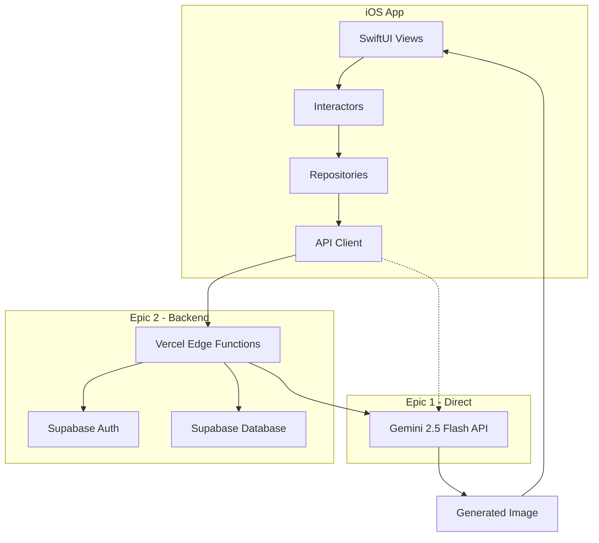

# 2. High Level Architecture

## Technical Summary
Facemake v3 implements a native iOS frontend with SwiftUI following Clean Architecture patterns, backed by Vercel Edge Functions and Supabase for authentication and data persistence. The core image generation uses Google Gemini 2.5 Flash API for generating professional headshots from prompts. The two-epic approach allows Epic 1 to function completely client-side with direct API calls, while Epic 2 adds proper backend infrastructure.

## Platform and Infrastructure
- **Platform:** Vercel (Edge Functions) + Supabase (Auth/Database)
- **Key Services:** Vercel Edge Functions, Supabase Auth/Database, Gemini 2.5 Flash
- **Deployment Regions:** Vercel Global Edge, Supabase US East

## Repository Structure
- **Structure:** Single repository, iOS-focused
- **Package Organization:** iOS app (Swift), Vercel functions (TypeScript), Shared types

## Architecture Diagram

## Architectural Patterns
- **Clean Architecture (iOS):** Separation of Views, Interactors, and Repositories
- **Serverless Functions:** Stateless API handlers on Vercel Edge
- **Repository Pattern:** Abstract data access from Gemini API
- **JWT Authentication:** Supabase-managed tokens
- **Atomic State Management:** SwiftUI @State and @StateObject
