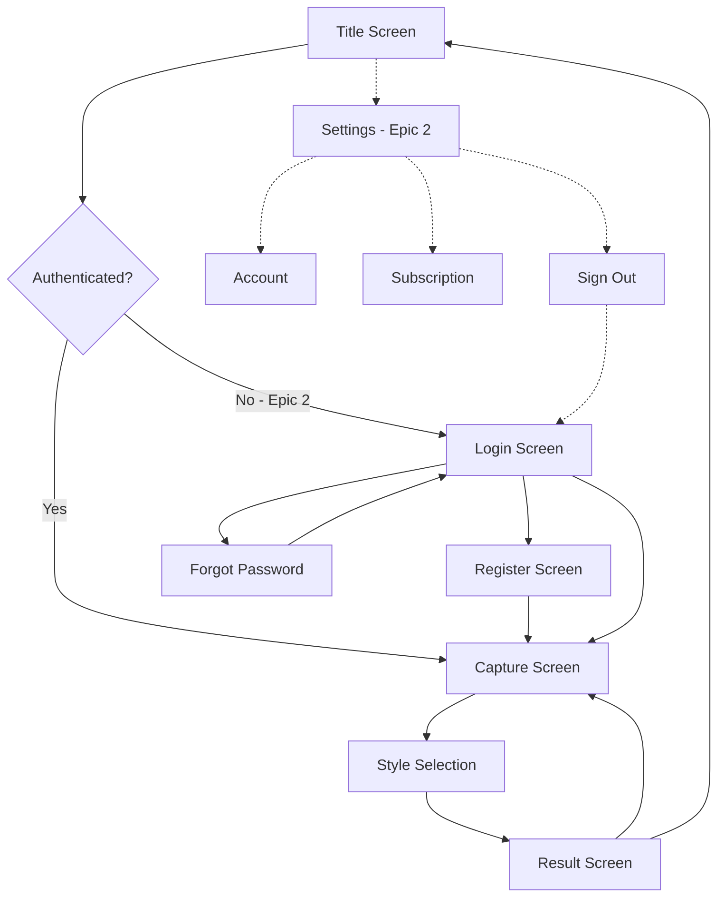
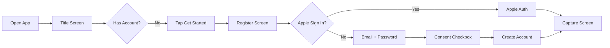
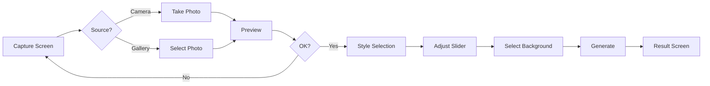

# Facemake v3 UI/UX Specification

## Introduction
This document defines the user experience goals, information architecture, user flows, and visual design specifications for Facemake v3's user interface. It serves as the foundation for visual design and frontend development, ensuring a cohesive and user-centered experience.

## Overall UX Goals & Principles

### Target User Personas
- **Quick-Start Student:** University students needing professional headshots NOW, zero learning curve required
- **Time-Pressed Professional:** Young professionals who need LinkedIn photos between meetings, no time for complexity

### Usability Goals
- Complete first headshot in under 60 seconds from app open
- Zero tutorial required - interface is self-evident
- Maximum 3 taps to professional photo
- One-thumb operation throughout entire flow

### Design Principles
1. **Radical Simplicity** - If it takes explanation, it's too complex
2. **Instant Gratification** - Show progress immediately, deliver value fast
3. **Forgiveness Over Permission** - Let users try again easily, minimize commitment anxiety
4. **Mobile-First Truth** - Designed for one-handed use while walking

---

## Information Architecture

### Site Map / Screen Inventory



### Navigation Structure

**Primary Navigation:** Linear flow with auth gate (Epic 2)

**Auth Flow (Epic 2 only):**
- Title Screen → Login → Main App
- Login ↔ Register (toggle between them)
- Login → Forgot Password → Email sent → Back to Login

**Main App Flow:**
- Capture → Style → Result → Loop or Exit

---

## User Flows

### Flow 1: First-Time User Registration (Epic 2)

**User Goal:** Create account and generate first professional headshot



### Flow 2: Generate Professional Headshot (Core Flow)

**User Goal:** Create a professional headshot in under 60 seconds



### Flow 3: Subscription Upgrade (Epic 2)

**User Goal:** Upgrade to Pro for unlimited generations


---

## Wireframes & Mockups

### Key Screen Layouts

#### 1. Title Screen
```
┌─────────────────┐
│                 │
│   [Logo Image]  │
│                 │
│   FacemakeAI    │
│                 │
│  Professional   │
│  headshots in   │
│  60 seconds     │
│                 │
│                 │
│ [Get Started →] │
│                 │
│                 │
│ Terms | Privacy │
└─────────────────┘
```

#### 2. Capture Screen
```
┌─────────────────┐
│ X           [↻] │
│                 │
│                 │
│  Camera Preview │
│   Full Screen   │
│                 │
│                 │
│                 │
│                 │
│ [📷]    [◉]     │
└─────────────────┘
```

#### 3. Style Selection (Simplified)
```
┌─────────────────┐
│ ← Adjust look   │
│                 │
│      Angle      │
│       👤        │
│ ←────[●]────→   │
│                 │
│ ┌─────┬─────┐   │
│ │ Pro │Casual│  │
│ │  ✓  │     │   │
│ └─────┴─────┘   │
│                 │
│                 │
│                 │
│  [Generate →]   │
│                 │
└─────────────────┘
```

#### 4. Result Screen
```
┌─────────────────┐
│ ←               │
│                 │
│ ┌─────────────┐ │
│ │             │ │
│ │  Generated  │ │
│ │    Image    │ │
│ │             │ │
│ └─────────────┘ │
│                 │
│ 2 photos left   │
│                 │
│ [Regenerate]    │
│                 │
│ [Save & Share]  │
│                 │
└─────────────────┘
```

---

## Component Library

### Design System Approach
Native iOS components with minimal customization. Use SF Symbols and system fonts.

### Core Components

1. **Primary Button** - Blue background, white text, 50pt height
2. **Secondary Button** - Clear background, blue text
3. **Slider** - Face icon rotates -45° to +45° based on position
4. **Toggle Buttons** - Two-button group (Professional/Casual)
5. **Text Input** - System default with 44pt height
6. **Loading Overlay** - Semi-transparent with spinner

---

## Branding & Style Guide

### Color Palette

| Color Type | Hex Code | Usage |
|------------|----------|--------|
| Primary | #007AFF | CTAs, selected states |
| Secondary | #5856D6 | Pro tier accents |
| Success | #34C759 | Confirmations |
| Warning | #FF9500 | Low credits |
| Error | #FF3B30 | Failed states |

### Typography

| Element | Size | Weight |
|---------|------|--------|
| H1 | 34pt | Bold |
| H2 | 28pt | Bold |
| Body | 17pt | Regular |
| Small | 15pt | Regular |

### Logo Specifications
- Icon: Face silhouette transitioning to pixels
- Wordmark: "FacemakeAI" in SF Pro Display
- App icon: Blue on white background

---

## Accessibility Requirements

### Compliance Target
WCAG 2.1 Level AA

### Key Requirements
- VoiceOver support throughout
- 44×44pt minimum touch targets
- Dynamic Type support
- Respect "Reduce Motion" setting
- 4.5:1 contrast ratios

---

## Responsiveness Strategy

### Device Support

| Device | Priority | Notes |
|--------|----------|--------|
| iPhone SE/Mini | P0 | Minimum size |
| iPhone Standard | P0 | Primary target |
| iPhone Pro Max | P0 | Luxury experience |
| iPad | P2 | Post-MVP |

### Adaptation
- Portrait only for MVP
- Single column layout
- Safe area compliance
- No landscape support

---

## Animation & Micro-interactions

### Motion Principles
- Instant feedback (< 100ms)
- Native iOS timing (0.3s default)
- Respect "Reduce Motion"

### Key Animations
- Button press: Scale 0.95
- Screen transitions: iOS push/pop
- Slider: Real-time icon rotation
- Image appear: 0.3s fade in

---

## Performance Considerations

### Goals
- < 1 second to interactive
- < 100ms interaction response
- 60fps animations

### Strategies
- Native components for performance
- Progressive image loading
- Minimal memory footprint

---

## Next Steps

### Immediate Actions
1. Build SwiftUI views from specs
2. Implement Epic 1 (no auth) first
3. Test with 5-10 internal users
4. Add Epic 2 after validation

### Design Handoff Checklist
✅ User flows documented
✅ Components defined
✅ Accessibility specified
✅ Responsive strategy clear
✅ Brand guidelines set
✅ Performance goals established

---

## Summary

FacemakeAI v3 MVP prioritizes **radical simplicity**:
- 4 core screens
- Slider + toggle style selection
- Native iOS components
- Zero onboarding
- 60-second experience goal

Every design decision reduces friction toward one goal: getting users a professional headshot as fast as possible.